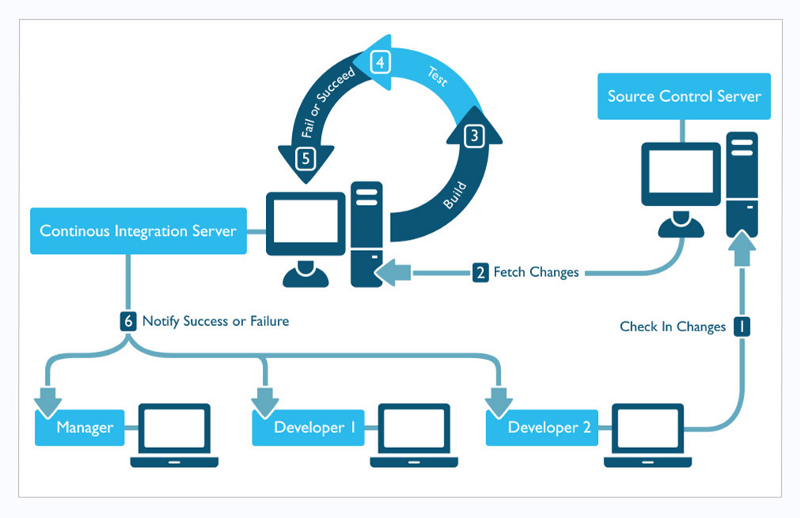

# CI-CD, Continuous Integration #

## Overview ##

**CI/CD introduces ongoing automation and continuous monitoring** throughout the lifecycle of applications -- from
integration and testing phases, to delivery and deployment. 

Taken together, these connected practices are often referred to as a "CI/CD pipeline" and are supported by
development and operations teams working together in an agile way with either a DevOps or site reliability engineering (SRE) approach.

## Continuous Integration ##

Continuous integration (CI) helps developers merge their code changes back to a shared branch,
or “trunk,” more frequently — sometimes even daily. Once a developer’s changes to an application are 
merged, those changes are validated by automatically building the application and running different 
levels of automated testing, typically unit and integration tests, to ensure the changes haven’t broken the 
app.

